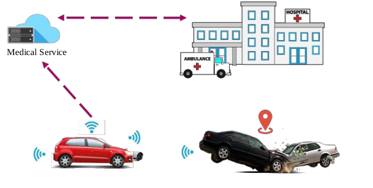

## How does Project ARC work?

In the event of an accident, the two cars involved start sending emergency messages using [DSRC](https://en.wikipedia.org/wiki/Dedicated_short-range_communications) to all nearby vehicles. Using a combination of factors (namely distance) a gateway car is chosen to communicate the accident to the emergency services.

 Block Diagram

## What can the emergency services expect?

When the accident is communicated to the emergency services, a lot of useful data can be sent as well.  

Mandatory Data:

- Velocity
- Location
- Pictures of the accident
- Video of the accident
- Several types of information retrieved from the vehicles CAN Bus:
    - Presence sensors
    - Airbag Deployment
  
Data to be sent if time permits:

- Livestream of the accident

